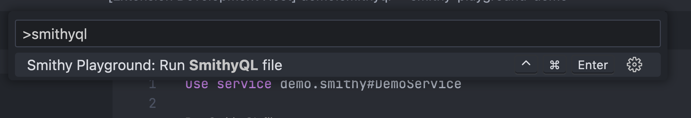

# smithy-playground

This is an experimental, work-in-progress project to develop a query language for Smithy.

Currently available as a LSP server with a client implementation for VS Code.

## Usage

1. Make sure you have [Coursier](https://get-coursier.io/docs/cli-installation) available on the PATH as `cs`, running Java 11 or above
2. Get the extension from [Marketplace](https://marketplace.visualstudio.com/items?itemName=kubukoz.smithy-playground)
3. Create a file, `smithy-build.json`. Example:

```jsonc
{
  // This comes from https://github.com/aws/aws-sdk-js-v3/blob/main/codegen/sdk-codegen/aws-models/kinesis.json
  "sources": [
    "/Users/kubukoz/projects/aws-sdk-js-v3/codegen/sdk-codegen/aws-models/kinesis.json"
  ],
  // For Smithy specs exported in jars
  "maven": {
    "dependencies": ["com.kubukoz:service-api:0.0.1"],
    // To access non-standard Maven repositories
    "repositories": ["https://<path-to-artifactory>"]
  },
  // for Playground plugins
  "smithyPlayground": {
    "extensions": ["com.kubukoz::playground-extension:0.0.1"]
  }
}
```

4. Open/create a .smithyql file
5. You should see output in the "Smithy Playground" panel, and after a while syntax/error highlighting in the open .smithyql files.

Here's an example of a SmithyQL file that works without any setup (or even a `smithy-build.json`):

```
use service playground.std#Clock

CurrentTimestamp {}
```

It uses a "standard library" of smithy-playground, which is always available.

Here's a more verbose example showcasing most of the language syntax. `DemoService` is defined in this repository's test suite.

```
use service demo.smithy#DemoService

CreateHero {
  hero: {
    good: {
      howGood: 42,
    },
  },
  friends: [
    {
      bad: {
        evilName: "Vader",
        powerLevel: 9001,
      },
    },
  ],
  doc: [
    "this is a document, so you can do pretty much anything here",
    null,
    false,
    42,
    {
      nested: "key",
    },
    [ ],
  ],
  hasNewtypes: {
    anInstant: "2022-10-08T00:46:31.378493Z",
    anUUID: "cd4f93e0-fd11-41f0-8f13-44f66e1f0997",
    power: "FIRE",
    powerMap: {
      FIRE: {
        good: {
          howGood: 10,
        },
      },
    },
  },
}

```

## Running queries

The runner needs a base URL to target with its queries. This defaults to `http://localhost:8080` and can be configured in the extention's preferences (a more first-class solution is planned):


or by manually changing the key in  `./vscode/settings.json`.

If a query typechecks, it can be executed by clicking on the "Run SmithyQL file" code lens...


or triggering the command from the Command Palette:



## Supported features

- Running queries via code lens or command
- Formatting
- Enabling/disabling line comments
- Completions (as long as the code is at least syntactically valid)
- Documentation in completions (operation docs, input/output types, structure member types)
- Document outline / breadcrumbs / "go to symbol in editor"
- Rough error highlighting on parse errors, type mismatches, missing fields
- AWS client calls for services supporting `@awsJson1_0` and `awsJson1_1`

## Syntax

Here's a more verbose description of the SmithyQL syntax.

### Literals

In general, in SmithyQL, value literals look very similar to JSON, with minor differences. They are also very similar to [Smithy's node values](https://awslabs.github.io/smithy/2.0/spec/model.html#node-value).

We have:

- string literals: `"like this"`
- numeric literals: `2137`, `42.0`, `4e10` - following the JSON spec of numbers
- booleans: `true`, `false`
- lists: `[ true, false, ]`
- structures: `{ k: "value", k2: true, k3: [ 10, 20, ], }` - note that keys aren't quoted, unlike in JSON
- null, but it's not what you think: the `null` literal only typechecks as two things:
  - a Smithy `Document`: corresponds to the [Null document](https://awslabs.github.io/smithy/2.0/spec/simple-types.html?highlight=null#document)
  - an element of a sparse collection.

### Type representation

#### Important note

Regardless of how SmithyQL treats the syntax for a given type, the way it's going to be sent over the wire
is still defined by the protocol's client implementation serializes it.

For example, even though SmithyQL treats all unions as tagged unions, if the protocol chooses to treat a union as a discriminated one (e.g. `@simpleRestJson` will do so [if you want](https://disneystreaming.github.io/smithy4s/docs/codegen/unions)), it's going to be a discriminated one in the payload sent to the service.

---

Most Smithy types map directly to a kind of literal, but there are some additions.

- unions: Smithy unions are written as `tagged unions` using structure syntax.

For the following union:

```
union A {
  f: Integer,
  g: String
}
```

to get a value corresponding to the `f` case, you should do something like `{ f: 40 }`.

- enums: Smithy enums are written as string literals using the name of the enum value.

```
enum Temperature {
  HOT: "Hot",
  COLD: "Cold"
}
```

In this case, the syntax would be `"HOT"` or `"COLD"`.

- timestamps: Smithy timestamps are always written using a string literal matching the `DATE_TIME` format, like
`"2022-10-08T00:46:31.378493Z"`.

- `unit` (the default input/output of an operation) is a structure with no fields: `{}`

- documents: Smithy documents are written using all the other syntax elements, with no typechecking

- maps: Smithy maps (currently only supporting string shapes as keys) are written as structures.
  At the moment, there's a limitation in the syntax - keys that aren't valid identifiers (alphabetical character then 0..n alphanumeric characters) don't parse.
  If the map's key is an enum, its name is written without quotes.

- smithy4s refinements: all validations provided by smithy4s are supported. If you find one that isn't, file an issue!
  Supporting additional validations, like your own, may be enabled in the future using the plugin infrastructure of Smithy Playground.

### Prelude

A SmithyQL file starts with a section called a prelude. It can contain use clauses (described below) available to all queries in the file.

For example:

```
use service playground.std#Clock
use service playground.std#Random
```

Use clauses are optional, as queries can refer to a service explicitly.

### Queries

A SmithyQL file can contain any number of Queries. A Query is formed of the following:

- an operation name
- the operation input (a structure literal)

An operation name can be either:

- fully qualified, in which case it looks like this: `playground.std#Clock.CurrentTimestamp` (using the service `playground.std#Clock` for just this single query)
- implicitly qualified, in which case it's just the operation name: `CurrentTimestamp`. You can only use implicitly qualified operation names if there's exactly one service in scope (added with `use service`) that contains an operation of the given name. Otherwise, you have to use an explicit reference.

Explicit (fully qualified) references always have priority over implicit ones.

#### use clauses - `use service`

A `use service` clause adds a service to the set of services that will implicitly be used as the default for all queries in a file.

For a single-query file, an explicit and implicit service reference are always equivalent:

```
use service playground.std#Clock

CurrentTimestamp {}
```

is the same as

```
playground.std#Clock.CurrentTimestamp {}
```

#### Operation inputs

The operation input is always a structure, even if there is no explicitly defined input for an operation (this is enforced by the Smithy language).

### Extra notes on syntax / the language

- Line comments like `//this one` are allowed almost everywhere, notably they're illegal within a `use service` clause.

- Trailing commas are supported in lists and objects, and they're preferred by the standard formatter. No, there aren't any other formatters.

- Formatting is quite whitespace-happy and optimizes for consistency.

- Syntax may change in the future, but any breaking changes will be phased in with a deprecation cycle, and an automated rewrite.

- Extra fields in structures are not allowed and will fail typechecking.


## Known issues

- Type errors and completions are only shown if the file parses. This is being worked on.
- It can take a couple seconds to activate the extension when the project is opened (JVM startup)
- AWS support requires credentials in scope for the entire editor instance
- See issue list

## Contributing / development notes

See [CONTRIBUTING.md](./CONTRIBUTING.md)
